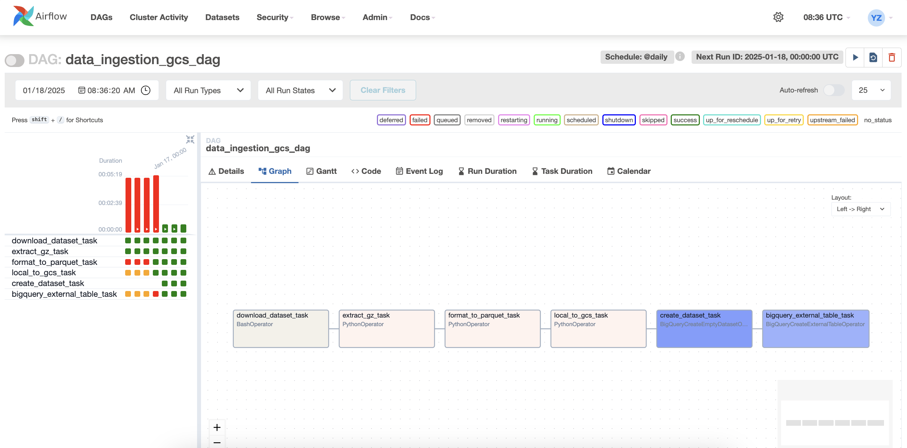

## Ingest data from web to google cloud and link to bigquery
- DAG:

## Ingest data from local file to local postgres

- DAG

-LOG

## Project structure

workflow_orchestration/
├── Dockerfile           
├── docker-compose.yaml   
├── airflow/
│   └── dags/
│       ├── __init__.py
│       └── dbt_dag.py
│
├── dbt/
│   ├── models/
│   │   ├── staging/
│   │   ├── core/
│   │   └── marts/
│   ├── macros/
│   ├── seeds/
│   ├── tests/
│   ├── dbt_project.yml
│   └── profiles.yml